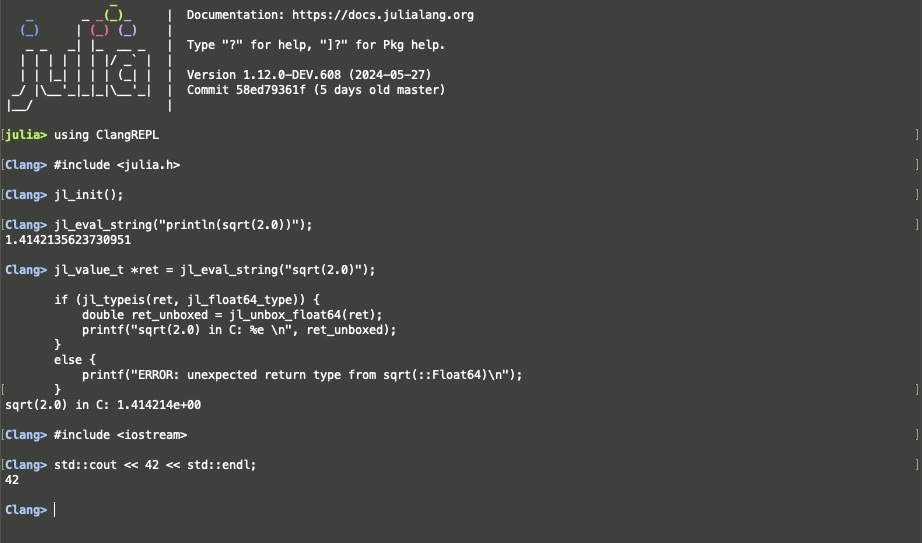

# ClangREPL

[](https://github.com/Gnimuc/ClangREPL.jl/actions/workflows/CI.yml?query=branch%3Amain)

This package provides a REPL mode to evaluate C/C++ code in the Julia REPL. 

This is a tool for playing with pure C/C++ stuff and does not provide any interoperability between Julia and C/C++.

## Installation

```julia-repl
pkg> dev https://github.com/Gnimuc/ClangREPL.jl.git
```

Press <kbd>,</kbd> to ...



## Credits

Inspiration drawn from [Pkg.jl](https://github.com/JuliaLang/Pkg.jl) and [LispREPL.jl](https://github.com/swadey/LispREPL.jl).